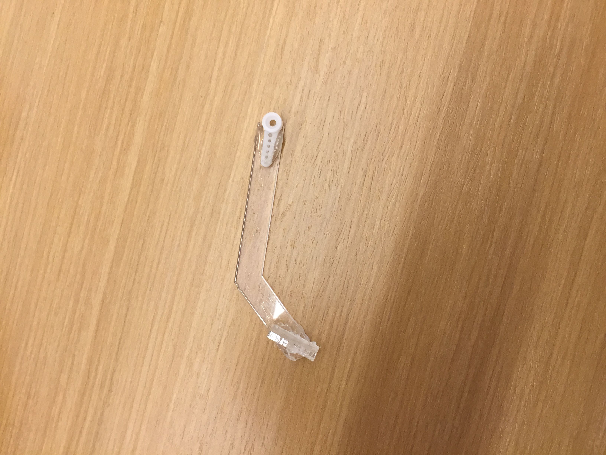
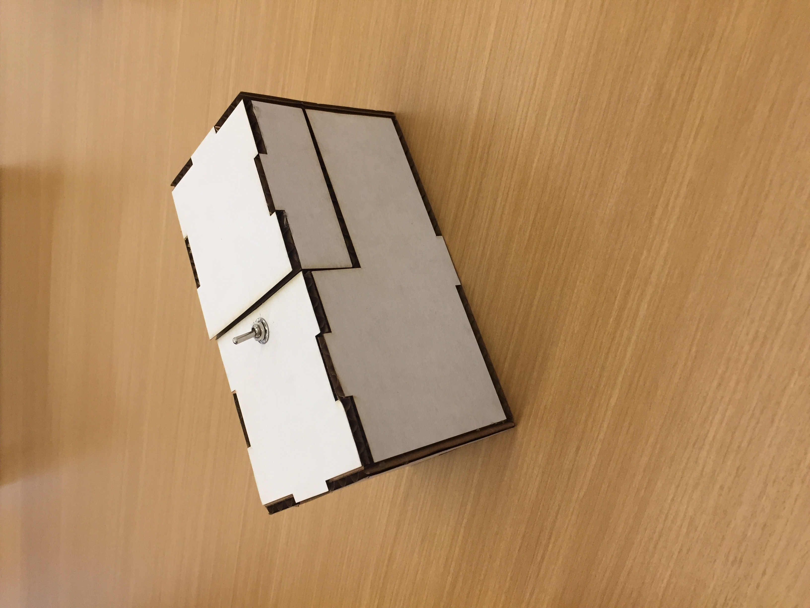
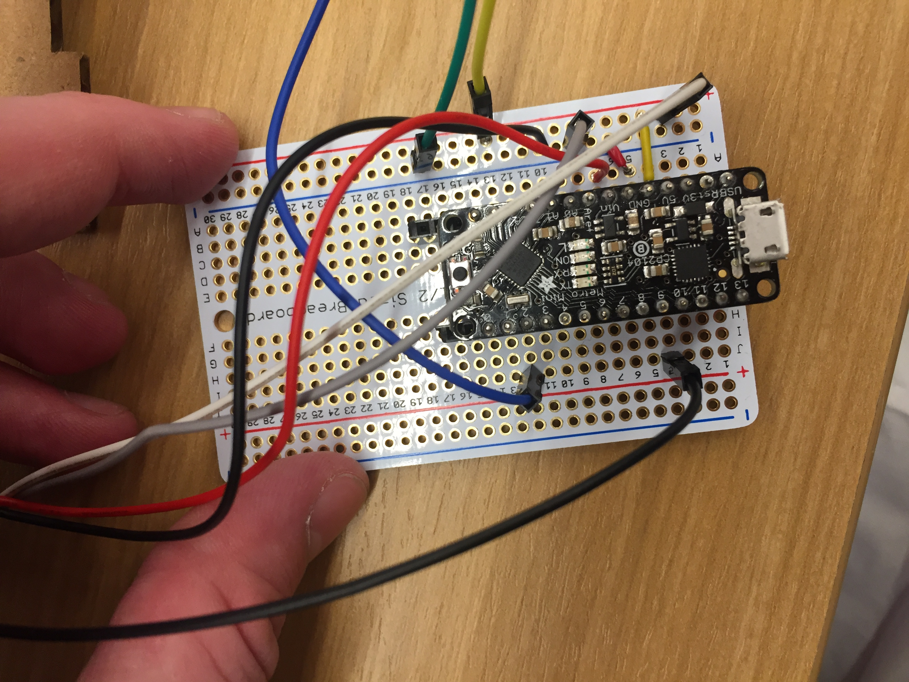

# Useless Box

## 3D Printing

**a. Include a photo of your printed part here.**



**b. Include `.stl` or `.svg` files for your bopper, if 3d-printing.**

[SVG file](./drawing.svg)

## Laser Cutting

**b. Include a photo of your box here.**



## Electronics

**c. Upload code & a photo of your electronic circuit here.**



Code:
``` 
#include <Servo.h> 

#define servoPin  10
#define switchPin 2

#define closePos  90
#define openPos   25

Servo servo;
int switchState;
int previousSwitchState;

// call this when the input on pin 2 changes (LOW to HIGH *or* HIGH to LOW)
void ToggleSwitch(int switchState)
{    
  if (switchState == HIGH)
  {
    servo.write(openPos);
    //Serial.println("switch state is HIGH.  servo.write(openPos) called to open useless box");
  }
  else
  {
    servo.write(closePos);
    //Serial.println("switch state is LOW.   servo.write(closePos) called to close useless box");
  }
  previousSwitchState = switchState;  // remember that the switch state has changed 
}

void setup()
{
  //Serial.begin(9600);
  //Serial.println("Useless Box Lab 5");

  // start with the box closed and the switch in the off postion
  switchState = LOW;
  previousSwitchState = LOW;

  // connect to our servo and make sure it is in the closed position
  servo.attach(servoPin);
  servo.write(closePos);

  // we should probably pay attention to the switch
  pinMode(switchPin, INPUT); 
}

void loop()
{ 
  int switchState = digitalRead(switchPin);
  if (switchState != previousSwitchState)
    ToggleSwitch(switchState);

  delay(100);
} 
```

## Putting it All Together

## Link to video of useless box in action 
[Video link](https://youtu.be/gpgsJwDz95k)

notes: My useless box did not work. I found that the servo did not have enough torque to push the switch closed. I found this after making several iterations on my bopper to try add more weight to the top and chanign the code to try maximize the pushing power of the motor however, the way I designed the box with the servo on the bottom was no conducive to it working.
